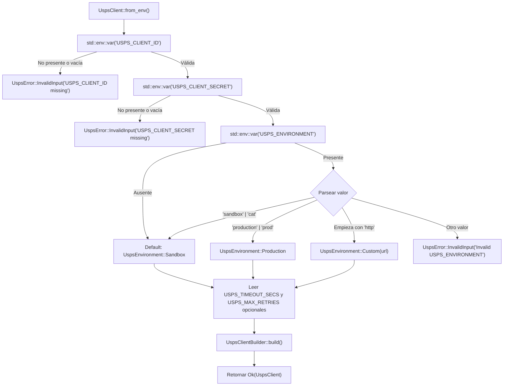
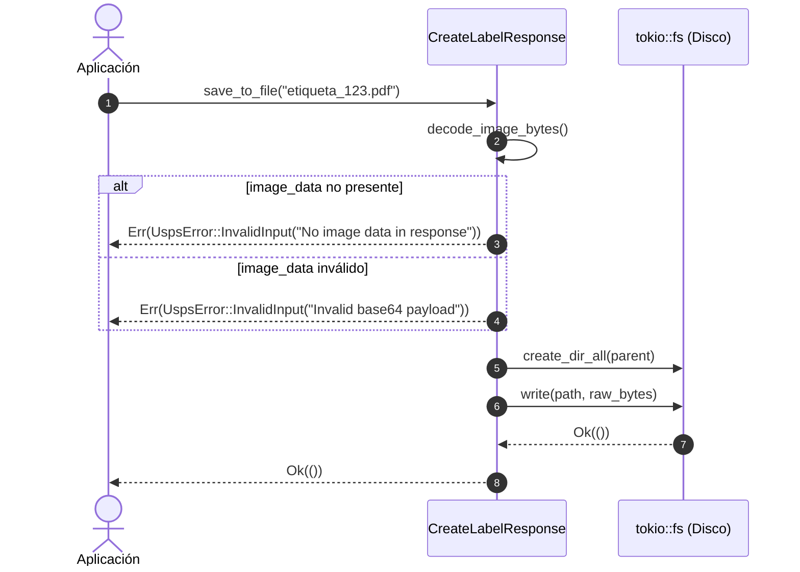
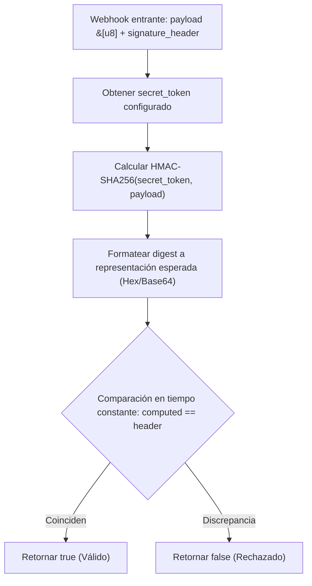
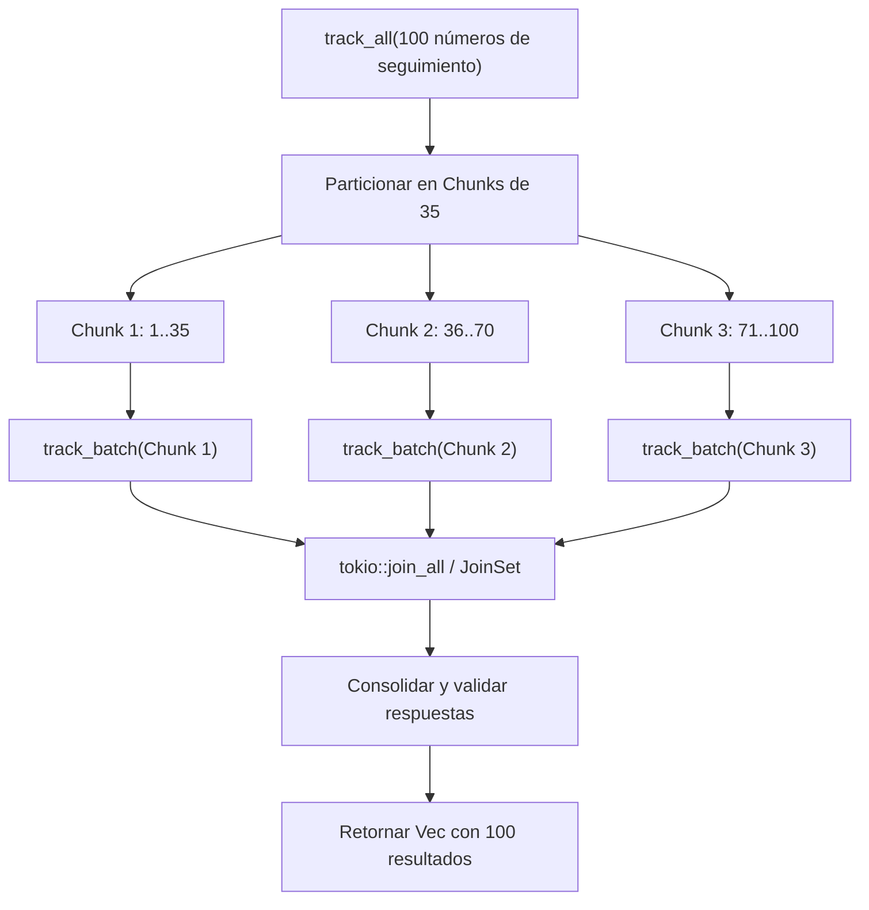
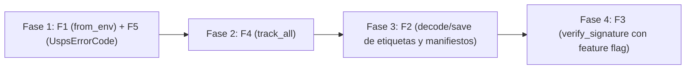

# Especificación Técnica de Nuevas Funcionalidades (`usps_v3_api`)

> [!IMPORTANT]
> **Estado:** Documento de diseño arquitectónico en espera de aprobación del usuario. **No se ha aplicado ninguna modificación de código ni se implementará nada hasta recibir aprobación expresa del plan.**

Este documento detalla la arquitectura técnica, justificación de negocio, contratos de tipos, interfaces de API públicas, comparativas de código antes/después, dependencias requeridas, análisis de riesgos y planes de verificación para las **5 nuevas funcionalidades recomendadas** para el SDK [`usps_v3_api`](file:///home/cesar/Proyectos/Rust/usps_v3_api/src/lib.rs).

---

## Índice
1. [F1: Inicialización desde Variables de Entorno (`UspsClient::from_env`)](#1-f1-inicialización-desde-variables-de-entorno-uspsclientfrom_env)
2. [F2: Utilidades para Decodificar y Guardar Etiquetas y Manifiestos (`decode_image_bytes` y `save_to_file`)](#2-f2-utilidades-para-decodificar-y-guardar-etiquetas-y-manifiestos)
3. [F3: Validador Criptográfico de Firmas de Webhooks (`WebhooksService::verify_signature`)](#3-f3-validador-criptográfico-de-firmas-de-webhooks)
4. [F4: Rastreo Masivo Particionado y Concurrente (`TrackingService::track_all`)](#4-f4-rastreo-masivo-particionado-y-concurrente-trackingservicetrack_all)
5. [F5: Catálogo Tipado de Códigos de Error Oficiales de USPS (`UspsErrorCode`)](#5-f5-catálogo-tipado-de-códigos-de-error-oficiales-de-usps-uspserrorcode)
6. [Matriz de Impacto, Dependencias y Retrocompatibilidad](#6-matriz-de-impacto-dependencias-y-retrocompatibilidad)
7. [Estrategia de Pruebas y Calidad](#7-estrategia-de-pruebas-y-calidad)
8. [Plan de Ejecución Secuencial](#8-plan-de-ejecución-secuencial)

---

## 1. F1: Inicialización desde Variables de Entorno (`UspsClient::from_env`)

### 1.1. Justificación y Diagnóstico
Actualmente, para inicializar [`UspsClient`](file:///home/cesar/Proyectos/Rust/usps_v3_api/src/core/client.rs#L24) se requiere invocar el builder pasando explícitamente cadenas literales:

```rust
let client = UspsClient::builder()
    .credentials("MY_ID", "MY_SECRET")
    .environment(UspsEnvironment::Sandbox)
    .build()?;
```

En entornos de producción modernos regidos por los principios de **The Twelve-Factor App** (despliegues en contenedores Docker, Kubernetes, AWS ECS, Google Cloud Run o microservicios serverless), las credenciales y el ambiente se inyectan como variables de entorno del sistema operativo. Sin esta utilidad nativa, cada usuario del SDK debe escribir código repetitivo con `std::env::var`, gestionar ausencias y parsear entornos.

### 1.2. Especificación Técnica

#### Variables de Entorno Estandarizadas
| Variable | Obligatoria | Valores Válidos / Formato | Valor por Defecto |
| :--- | :--- | :--- | :--- |
| `USPS_CLIENT_ID` | **Sí** | Cadena alfanumérica no vacía | N/A (Retorna error si falta) |
| `USPS_CLIENT_SECRET` | **Sí** | Cadena secreta no vacía | N/A (Retorna error si falta) |
| `USPS_ENVIRONMENT` | No | `sandbox`, `cat`, `production`, `prod` o URL `https://...` | `sandbox` |
| `USPS_TIMEOUT_SECS` | No | Entero positivo (`u64`) | `30` |
| `USPS_MAX_RETRIES` | No | Entero (`usize`) | `3` |

#### Diagrama de Flujo (Mermaid)


#### Firma de la Interfaz Pública
```rust
impl UspsClient {
    /// Inicializa un cliente leyendo las credenciales y configuración
    /// desde las variables de entorno estándar del sistema.
    ///
    /// # Errores
    /// Retorna [`UspsError::InvalidInput`] si faltan `USPS_CLIENT_ID` o
    /// `USPS_CLIENT_SECRET`, o si los valores numéricos son inválidos.
    pub fn from_env() -> Result<Self>;

    /// Retorna un builder pre-cargado con las variables de entorno,
    /// permitiendo sobrescribir parámetros puntuales antes de construirlo.
    pub fn builder_from_env() -> Result<UspsClientBuilder>;
}
```

#### Código Comparativo

**Antes:**
```rust
let client_id = std::env::var("USPS_CLIENT_ID")
    .map_err(|_| UspsError::InvalidInput("USPS_CLIENT_ID no configurada".into()))?;
let client_secret = std::env::var("USPS_CLIENT_SECRET")
    .map_err(|_| UspsError::InvalidInput("USPS_CLIENT_SECRET no configurada".into()))?;
let env = match std::env::var("USPS_ENVIRONMENT").as_deref() {
    Ok("production") => UspsEnvironment::Production,
    _ => UspsEnvironment::Sandbox,
};
let client = UspsClient::builder()
    .credentials(client_id, client_secret)
    .environment(env)
    .build()?;
```

**Después:**
```rust
let client = UspsClient::from_env()?;
```

---

## 2. F2: Utilidades para Decodificar y Guardar Etiquetas y Manifiestos

### 2.1. Justificación y Diagnóstico
Al emitir una etiqueta ([`CreateLabelResponse`](file:///home/cesar/Proyectos/Rust/usps_v3_api/src/services/labels/types.rs)) o generar un manifiesto SCAN Form ([`CreateManifestResponse`](file:///home/cesar/Proyectos/Rust/usps_v3_api/src/services/manifests.rs)), la API REST de USPS entrega el contenido binario de la imagen o documento codificado en formato **Base64** dentro de campos como `image_info.image_data` o `manifest_file`.

Actualmente, el consumidor del SDK tiene que:
1. Extraer manualmente la cadena Base64 navegando en estructuras anidadas.
2. Depender e importar un crate externo de Base64 en su propia aplicación.
3. Escribir manualmente la lógica asíncrona de I/O de disco para persistir el archivo en PDF/PNG.

### 2.2. Especificación Técnica

#### Interfaz de `CreateLabelResponse`
```rust
impl CreateLabelResponse {
    /// Decodifica la imagen Base64 retornando los bytes crudos (PDF, PNG, TIFF o SVG).
    ///
    /// # Errores
    /// Retorna [`UspsError::InvalidInput`] si la respuesta no incluye datos de imagen
    /// o si la cadena Base64 contiene caracteres inválidos.
    pub fn decode_image_bytes(&self) -> Result<Vec<u8>>;

    /// Guarda la etiqueta decodificada directamente en la ruta especificada en disco.
    ///
    /// Crea los directorios padre si no existen y escribe el archivo de forma asíncrona.
    pub async fn save_to_file(&self, path: impl AsRef<std::path::Path>) -> Result<()>;
}
```

#### Interfaz de `CreateManifestResponse`
```rust
impl CreateManifestResponse {
    /// Decodifica el archivo de manifiesto SCAN Form (PS Form 5630) en bytes crudos.
    pub fn decode_manifest_bytes(&self) -> Result<Vec<u8>>;

    /// Guarda el manifiesto directamente en disco de manera asíncrona.
    pub async fn save_to_file(&self, path: impl AsRef<std::path::Path>) -> Result<()>;
}
```

#### Diagrama de Secuencia (Mermaid)


#### Dependencias Requeridas
- Decodificación Base64: Se evaluará la adición del crate estándar ligero `base64 = "0.22"` o una implementación mínima nativa libre de dependencias.
- I/O de Archivos Asíncrono: Habilitar la característica `"fs"` en `tokio` dentro de `Cargo.toml`:
  ```toml
  tokio = { version = "1.43", features = ["rt", "sync", "time", "macros", "fs"] }
  ```

---

## 3. F3: Validador Criptográfico de Firmas de Webhooks

### 3.1. Justificación y Diagnóstico
Al suscribirse a eventos de paquetería mediante [`WebhooksService`](file:///home/cesar/Proyectos/Rust/usps_v3_api/src/services/webhooks.rs), USPS despacha notificaciones POST HTTP a la URL registrada. Si el suscriptor configuró un `secret_token`, USPS calcula y envía una firma en los encabezados HTTP (ej. `X-USPS-Signature` con algoritmo **HMAC-SHA256**) para que el servidor receptor verifique la autenticidad y evite peticiones fraudulentas (*man-in-the-middle* o suplantación).

El SDK carece actualmente de un método estándar para verificar dicha firma contra el cuerpo de la petición.

### 3.2. Especificación Técnica

#### Algoritmo de Verificación
1. Obtiene la clave secreta compartida (`secret_token`).
2. Computa `HMAC_SHA256(secret, payload_bytes)`.
3. Codifica el hash resultante en formato Hexadecimal (o Base64 según especificación USPS).
4. Compara la firma calculada contra el encabezado recibido utilizando **comparación en tiempo constante** (*constant-time comparison*) para neutralizar ataques de temporización (*timing attacks*).

#### Diagrama de Flujo (Mermaid)


#### Firma de la Interfaz
```rust
impl WebhooksService {
    /// Valida la autenticidad de una notificación entrante de webhook mediante HMAC-SHA256.
    ///
    /// Emplea comparación segura en tiempo constante para mitigar ataques de temporización.
    ///
    /// # Parámetros
    /// - `payload`: Bytes crudos del cuerpo de la petición HTTP recibida.
    /// - `signature_header`: Valor recibido en la cabecera HTTP de firma (ej. `X-USPS-Signature`).
    /// - `secret_token`: Clave secreta definida al crear la suscripción.
    pub fn verify_signature(payload: &[u8], signature_header: &str, secret_token: &str) -> bool;
}
```

#### Gestión de Dependencias
Para evitar incrementar el tiempo de compilación y peso de la librería para usuarios que no consumen webhooks, esta funcionalidad se encapsulará bajo una **Cargo Feature Flag opcional**:
```toml
[features]
default = ["rustls-tls"]
webhook-verification = ["dep:hmac", "dep:sha2"]

[dependencies]
hmac = { version = "0.12", optional = true }
sha2 = { version = "0.10", optional = true }
```

---

## 4. F4: Rastreo Masivo Particionado y Concurrente (`TrackingService::track_all`)

### 4.1. Justificación y Diagnóstico
La API oficial `GET /tracking/v3/tracking` impone una restricción fija: **un máximo de 35 números de seguimiento por petición**.
Actualmente, [`TrackingService::track_batch`](file:///home/cesar/Proyectos/Rust/usps_v3_api/src/services/tracking.rs#L181) valida estrictamente este límite:
```rust
if tracking_numbers.is_empty() || tracking_numbers.len() > 35 {
    return Err(UspsError::InvalidInput(...));
}
```

Empresas de e-commerce, logística y almacenes procesan habitualmente entre 50 y miles de paquetes simultáneamente. Obligar al consumidor a partir manualmente sus listas en bloques de 35 y gestionar múltiples llamadas asíncronas genera fricción y código propenso a errores de concurrencia y rate limiting.

### 4.2. Especificación Técnica

#### Algoritmo de Particionado y Despacho Concurrente
1. Si la lista está vacía, retorna un vector vacío inmediatamente sin llamadas de red.
2. Fragmenta el arreglo de números en trozos (*chunks*) de longitud máxima `35`.
3. Despacha cada fragmento de manera asíncrona utilizando `tokio::task::JoinSet` o `futures::future::join_all` a través del cliente unificado con reintentos (`execute_with_retry`).
4. Recombina los resultados en un único `Vec<TrackingResponse>` manteniendo la integridad y el orden correspondiente.
5. Permite configurar la concurrencia máxima para no saturar los límites de tasa de la API de USPS.

#### Diagrama de Arquitectura (Mermaid)


#### Firma de la Interfaz
```rust
impl TrackingService {
    /// Rastrear una lista arbitrariamente grande de paquetes.
    ///
    /// El método fragmenta automáticamente la lista en bloques de 35 (límite de USPS),
    /// ejecuta las consultas de forma concurrente respetando la política de reintentos
    /// y agrega las respuestas en un único vector.
    pub async fn track_all<S: AsRef<str>>(
        &self,
        tracking_numbers: &[S],
        expand: TrackingExpand,
    ) -> Result<Vec<TrackingResponse>>;
}
```

---

## 5. F5: Catálogo Tipado de Códigos de Error Oficiales de USPS (`UspsErrorCode`)

### 5.1. Justificación y Diagnóstico
Cuando USPS retorna un error HTTP 4xx/5xx con cuerpo JSON, [`UspsApiErrorResponse`](file:///home/cesar/Proyectos/Rust/usps_v3_api/src/core/error.rs#L50) expone los campos como `String`:
```rust
pub struct ApiErrorDetail {
    pub error_code: Option<String>,
    pub message: Option<String>,
}
```

Para tomar decisiones automatizadas en lógica de negocio (por ejemplo: si una dirección no es válida marcarla para revisión humana, si se agotó el saldo EPS recargar la cuenta, o si el paquete no existe reintentar más tarde), el desarrollador tiene que recurrir a comparaciones de cadenas frágiles (`error.message.contains("not found")`), propensas a romperse ante cambios mínimos de puntuación o mayúsculas por parte de USPS.

### 5.2. Especificación Técnica

#### Estructura del Enum `UspsErrorCode`
```rust
#[derive(Debug, Clone, PartialEq, Eq, Hash, Serialize, Deserialize)]
#[non_exhaustive]
pub enum UspsErrorCode {
    // Errores de Direcciones
    AddressNotFound,
    InvalidZipCode,
    MultipleAddressesFound,

    // Errores de Autenticación y Autorización
    InvalidCredentials,
    TokenExpired,
    Unauthorized,

    // Errores de Límites y Cuotas
    RateLimitExceeded,
    QuotaExceeded,

    // Errores de Rastreo
    TrackingNumberNotFound,
    InvalidTrackingNumberFormat,

    // Errores de Etiquetas y Manifiestos
    LabelAlreadyCancelled,
    LabelExpired,
    InsufficientFunds,
    DuplicateManifest,

    // Errores de Disponibilidad
    PickupNotAvailable,
    ServiceUnavailable,

    // Variante de escape para compatibilidad hacia adelante
    Other(String),
}
```

#### Métodos Asistentes en `UspsError`
```rust
impl UspsError {
    /// Intenta categorizar el error de la API en un código de error tipado de USPS.
    pub fn error_code(&self) -> Option<UspsErrorCode>;

    /// Indica si el error se debe a un recurso no encontrado (404 / NotFound).
    pub fn is_not_found(&self) -> bool;

    /// Indica si el error se debe a exceso de tasa de peticiones (429 / RateLimit).
    pub fn is_rate_limited(&self) -> bool;

    /// Indica si el error es atribuible a credenciales o autenticación (401 / 403).
    pub fn is_auth_error(&self) -> bool;
}
```

#### Código Comparativo

**Antes:**
```rust
match client.addresses().standardize(&req).await {
    Err(UspsError::Api(api_err)) if api_err.error.message.to_lowercase().contains("not found") => {
        // Frágil ante cambios de texto de la API
    }
    _ => ...
}
```

**Después:**
```rust
match client.addresses().standardize(&req).await {
    Err(ref err) if err.is_not_found() => {
        // Comprobación semántica y robusta
    }
    Err(ref err) if err.error_code() == Some(UspsErrorCode::InvalidZipCode) => {
        // Manejo específico del código de error
    }
    _ => ...
}
```

---

## 6. Matriz de Impacto, Dependencias y Retrocompatibilidad

| Feature | Archivos a Modificar | Nuevas Dependencias | Feature Flags | Breaking Change |
| :--- | :--- | :--- | :--- | :--- |
| **F1: `from_env`** | `src/core/client.rs`, `src/core/config.rs` | Ninguna (`std::env`) | Ninguna | **No** (Adición pura) |
| **F2: `decode/save`** | `src/services/labels/types.rs`, `src/services/manifests.rs` | `base64` (ligero) + `tokio/fs` | Ninguna | **No** (Adición pura) |
| **F3: `verify_signature`**| `src/services/webhooks.rs` | `hmac`, `sha2` | `webhook-verification` (opcional) | **No** (Adición pura) |
| **F4: `track_all`** | `src/services/tracking.rs` | Ninguna (`tokio`) | Ninguna | **No** (Adición pura) |
| **F5: `UspsErrorCode`** | `src/core/error.rs` | Ninguna | Ninguna | **No** (Adición pura) |

Todas las funcionalidades propuestas son **100% aditivas y retrocompatibles**: no modifican firmas existentes, no alteran tipos públicos existentes y no rompen ninguna de las 55 pruebas automatizadas vigentes.

---

## 7. Estrategia de Pruebas y Calidad

Para cada una de las 5 funcionalidades se implementará una suite de pruebas rigurosa:

1. **Pruebas Unitarias para F1 (`from_env`):**
   - Configuración de variables de entorno simuladas con aislamiento de hilos para validar:
     - Detección de falta de `USPS_CLIENT_ID` y `USPS_CLIENT_SECRET`.
     - Resolución correcta de `sandbox`, `production` y URLs `Custom`.
     - Parseo de timeouts y retries opcionales.

2. **Pruebas Unitarias para F2 (`decode_image_bytes` y `save_to_file`):**
   - Validación de decodificación de strings Base64 válidos (PDFs sintéticos).
   - Manejo de error controlado ante Base64 corrupto o campos ausentes.
   - Escritura y lectura de archivo temporal con `tempfile` comprobando integridad binaria.

3. **Pruebas Unitarias para F3 (`verify_signature`):**
   - Vectores de prueba RFC 2104 / NIST para HMAC-SHA256 con payloads y claves predefinidas.
   - Verificación de rechazo ante payloads manipulados o firmas alteradas.

4. **Pruebas de Integración con Mock Server para F4 (`track_all`):**
   - Simulación con `wiremock` de 80 números de seguimiento (requiere 3 fragmentos: 35 + 35 + 10).
   - Verificación de que se emitan exactamente 3 peticiones HTTP y se unifiquen los 80 resultados sin pérdidas.

5. **Pruebas Unitarias para F5 (`UspsErrorCode`):**
   - Deserialización de errores reales de USPS y mapeo a las variantes del enum.
   - Comprobación de métodos utilitarios `is_not_found()`, `is_rate_limited()`, etc.

---

## 8. Plan de Ejecución Secuencial

Una vez aprobada esta especificación por el usuario, la implementación se ejecutará en **4 fases lógicas ordenadas por impacto y ausencia de dependencias externas**:



- **Fase 1 (Inmediata / Zero-Deps):** Implementar `from_env()` y `UspsErrorCode`. Cero dependencias adicionales, elevación inmediata de la ergonomía.
- **Fase 2 (Concurrencia / Zero-Deps):** Implementar `track_all()` en `TrackingService`. Cero dependencias adicionales, resuelve la limitación de 35 envíos de USPS.
- **Fase 3 (I/O y Base64):** Habilitar `tokio/fs` y decodificación de etiquetas/manifiestos.
- **Fase 4 (Criptografía y Webhooks):** Implementar `verify_signature()` bajo el feature flag opcional `webhook-verification`.
