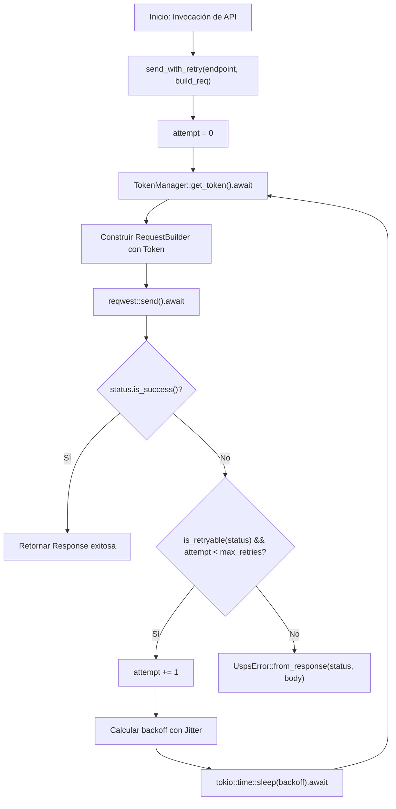

# Especificación Técnica de Refactorizaciones Recomendadas (`usps_v3_api`)

> [!IMPORTANT]
> **Estado:** Documento de diseño arquitectónico en espera de aprobación del usuario. No se ha aplicado ninguna modificación sobre la base de código existente.

Este documento detalla la arquitectura, justificación, diseño de tipos, código comparativo (antes vs. después), análisis de riesgos y plan de verificación para las 3 refactorizaciones recomendadas en el SDK [`usps_v3_api`](file:///home/cesar/Proyectos/Rust/usps_v3_api/src/lib.rs).

---

## Índice
1. [R1: Unificación del Bucle de Despacho HTTP con Reintentos (`send_with_retry`)](#1-r1-unificación-del-bucle-de-despacho-http-con-reintentos)
2. [R2: Modularización de Servicios Extensos (`prices` y `labels`)](#2-r2-modularización-de-servicios-extensos)
3. [R3: Formalización Algorítmica de Jitter en `RetryPolicy`](#3-r3-formalización-algorítmica-de-jitter-en-retrypolicy)
4. [Matriz de Riesgos y Compatibilidad](#4-matriz-de-riesgos-y-compatibilidad)
5. [Estrategia de Pruebas y Validación](#5-estrategia-de-pruebas-y-validación)
6. [Plan de Ejecución Secuencial](#6-plan-de-ejecución-secuencial)

---

## 1. R1: Unificación del Bucle de Despacho HTTP con Reintentos

### 1.1. Diagnóstico del Problema
En el archivo [`src/core/client.rs`](file:///home/cesar/Proyectos/Rust/usps_v3_api/src/core/client.rs), los métodos de transporte:
- `get_with_query` (L150-L200)
- `post_json` (L202-L252)
- `delete` (L254-L300)

duplican de forma idéntica un bloque de ~35 líneas que implementa:
1. Adquisición del Bearer Token vía [`TokenManager::get_token`](file:///home/cesar/Proyectos/Rust/usps_v3_api/src/core/auth.rs#L55).
2. Construcción del encabezado `Authorization: Bearer <token>`.
3. Invocación de red asíncrona `.send().await`.
4. Extracción de `status` y lectura de cuerpo `.text().await`.
5. Comprobación de éxito con `status.is_success()`.
6. Evaluación de código reintentable con [`RetryPolicy::is_retryable_status`](file:///home/cesar/Proyectos/Rust/usps_v3_api/src/core/retry.rs#L59) y conteo de intentos.
7. Cálculo de backoff y espera con `tokio::time::sleep`.
8. Fallback a [`UspsError::from_response`](file:///home/cesar/Proyectos/Rust/usps_v3_api/src/core/error.rs#L104).

#### Diagrama de Flujo Unificado (Mermaid)


### 1.2. Diseño Propuesto

Se propone introducir en [`UspsClient`](file:///home/cesar/Proyectos/Rust/usps_v3_api/src/core/client.rs#L24) una función privada genérica de orden superior:

```rust
impl UspsClient {
    /// Despacha una solicitud HTTP aplicando la política de reintentos y autenticación OAuth 2.0 unificada.
    async fn execute_with_retry<F>(&self, endpoint: &str, build_req: F) -> Result<String>
    where
        F: Fn(&reqwest::Client, &str, &str) -> reqwest::RequestBuilder,
    {
        let url = format!("{}{endpoint}", self.inner.config.environment.base_url());
        let mut attempt = 0;

        loop {
            let token = self.inner.token_manager.get_token().await?;

            let request = build_req(&self.inner.http_client, &url, &token)
                .header("Accept", "application/json");

            let response = request.send().await.map_err(UspsError::Http)?;
            let status = response.status();
            let body = response.text().await.map_err(UspsError::Http)?;

            if status.is_success() {
                return Ok(body);
            }

            if RetryPolicy::is_retryable_status(status)
                && attempt < self.inner.config.retry_policy.max_retries
            {
                attempt += 1;
                let backoff = self.inner.config.retry_policy.calculate_backoff(attempt);
                tracing::warn!(
                    attempt = attempt,
                    max_retries = self.inner.config.retry_policy.max_retries,
                    status = %status,
                    endpoint = endpoint,
                    backoff_ms = backoff.as_millis(),
                    "Error reintentable HTTP de USPS. Reintentando tras pausa"
                );
                tokio::time::sleep(backoff).await;
                continue;
            }

            return Err(UspsError::from_response(status, &body));
        }
    }
}
```

### 1.3. Simplificación de Métodos Públicos

Con este núcleo, los métodos de despacho se reducen a expresiones declarativas sin duplicación:

```rust
    pub async fn get_with_query<Q, T>(&self, endpoint: &str, query: &Q) -> Result<T>
    where
        Q: Serialize + ?Sized,
        T: DeserializeOwned,
    {
        let body = self.execute_with_retry(endpoint, |http, url, token| {
            http.get(url)
                .header("Authorization", format!("Bearer {token}"))
                .query(query)
        }).await?;

        serde_json::from_str::<T>(&body).map_err(UspsError::Serialization)
    }

    pub async fn post_json<B, T>(&self, endpoint: &str, body: &B) -> Result<T>
    where
        B: Serialize + ?Sized,
        T: DeserializeOwned,
    {
        let res_body = self.execute_with_retry(endpoint, |http, url, token| {
            http.post(url)
                .header("Authorization", format!("Bearer {token}"))
                .json(body)
        }).await?;

        serde_json::from_str::<T>(&res_body).map_err(UspsError::Serialization)
    }

    pub async fn delete(&self, endpoint: &str) -> Result<String> {
        self.execute_with_retry(endpoint, |http, url, token| {
            http.delete(url)
                .header("Authorization", format!("Bearer {token}"))
        }).await
    }
```

#### Ventajas:
- **Reducción de líneas:** ~95 líneas de código repetitivo eliminadas.
- **Consistencia de Telemetría:** Mismos campos estructurados en `tracing` para todos los métodos HTTP.
- **Extensibilidad:** Agregar `PUT` o `PATCH` requiere únicamente 5 líneas.

---

## 2. R2: Modularización de Servicios Extensos

### 2.1. Diagnóstico del Problema
Actualmente:
- [`src/services/prices.rs`](file:///home/cesar/Proyectos/Rust/usps_v3_api/src/services/prices.rs): **715 líneas**. Contiene lógica de cotización nacional, internacional, servicios adicionales (Extra Services), además de 9 structs y 3 enums en el mismo archivo.
- [`src/services/labels.rs`](file:///home/cesar/Proyectos/Rust/usps_v3_api/src/services/labels.rs): **536 líneas**. Contiene generación de etiquetas, cancelación, Label Broker QR, recuperación de imagen y 9 estructuras complejas.

Mezclar los contratos de datos (DTOs) con los métodos de llamada HTTP en un único archivo penaliza la legibilidad, complica la revisión de cambios en PRs y reduce la modularidad interna.

### 2.2. Diseño Propuesto (Estructura de Directorios)

Se propone transformar dichos módulos en submódulos encapsulados conservando **exactamente las mismas rutas de importación y re-exportación pública**:

```
src/services/
├── prices/
│   ├── mod.rs          # Re-exportaciones y definición del struct PricesService
│   └── types.rs        # Enums y DTOs (MailClass, ExtraServiceType, RateRequests/Responses)
├── labels/
│   ├── mod.rs          # Re-exportaciones y definición del struct LabelsService
│   └── types.rs        # DTOs (CreateLabelRequest, LabelBrokerRequest, LabelPartyAddress, etc.)
```

#### Preservación de Compatibilidad de la API Pública
En [`src/services/mod.rs`](file:///home/cesar/Proyectos/Rust/usps_v3_api/src/services/mod.rs) y [`src/lib.rs`](file:///home/cesar/Proyectos/Rust/usps_v3_api/src/lib.rs):
```rust
// Totalmente transparente para el consumidor:
pub use prices::{
    DomesticRateRequest, DomesticRateResponse, ExtraServiceRateItem, ExtraServiceType,
    ExtraServicesRateRequest, ExtraServicesRateResponse, InternationalMailClass,
    InternationalRateRequest, InternationalRateResponse, MailClass, PricesService,
    ProcessingCategory, RateItem,
};
pub use labels::{
    CancelLabelResponse, CreateLabelRequest, CreateLabelResponse, ImageInfo, LabelBrokerRequest,
    LabelBrokerResponse, LabelImageType, LabelPartyAddress, LabelSize, LabelsService,
    PackageDescription,
};
```
> [!NOTE]
> Para cualquier consumidor externo del SDK (ej. `use usps_v3_api::*` o `use usps_v3_api::services::prices::*`), la API pública es 100% idéntica y no constituye un cambio que rompa compatibilidad (*breaking change*).

---

## 3. R3: Formalización Algorítmica de Jitter en `RetryPolicy`

### 3.1. Diagnóstico del Problema
En [`src/core/retry.rs`](file:///home/cesar/Proyectos/Rust/usps_v3_api/src/core/retry.rs#L72):
```rust
    pub fn calculate_backoff(&self, attempt: u32) -> Duration {
        if attempt == 0 || self.max_retries == 0 {
            return Duration::ZERO;
        }

        let factor = 2u64.saturating_pow(attempt.saturating_sub(1));
        let calculated = self.initial_delay.saturating_mul(factor as u32);

        calculated.min(self.max_delay)
    }
```
El cálculo actual es un backoff exponencial **completamente determinístico y sin aleatoriedad (*jitter*)**.
Si 100 clientes o tareas de Tokio reciben un HTTP 429 de USPS al mismo segundo, todos esperarán exactamente 200ms, 400ms y 800ms, reintentando exactamente al mismo instante y saturando nuevamente el servidor postal (*thundering herd problem*).

### 3.2. Diseño Algorítmico: Estrategia Full Jitter de AWS

El whitepaper clásico de arquitectura de AWS (*Exponential Backoff And Jitter*) demuestra que **Full Jitter** ofrece el menor tiempo de recuperación y la menor colisión:

$$t_{\text{sleep}} = \text{random}(0, \, \min(t_{\text{max}}, \, t_{\text{base}} \times 2^{\text{attempt}-1}))$$

Para no agregar una dependencia pesada en `rand` (manteniendo el crate ligero y compilable rápido), implementamos un generador pseudoaleatorio ultra-rápido de 64 bits (**SplitMix64**) con semilla mutable en `AtomicU64` basada en el reloj de alta resolución del sistema:

```rust
use std::sync::atomic::{AtomicU64, Ordering};
use std::time::{Duration, SystemTime, UNIX_EPOCH};

static JITTER_SEED: AtomicU64 = AtomicU64::new(0);

fn next_random_u64() -> u64 {
    let mut state = JITTER_SEED.load(Ordering::Relaxed);
    if state == 0 {
        state = SystemTime::now()
            .duration_since(UNIX_EPOCH)
            .map(|d| d.as_nanos() as u64)
            .unwrap_or(0x9E3779B97F4A7C15);
    }
    // Algoritmo SplitMix64
    state = state.wrapping_add(0x9E3779B97F4A7C15);
    JITTER_SEED.store(state, Ordering::Relaxed);
    let mut z = state;
    z = (z ^ (z >> 30)).wrapping_mul(0xBF58476D1CE4E5B9);
    z = (z ^ (z >> 27)).wrapping_mul(0x94D049BB133111EB);
    z ^ (z >> 31)
}
```

#### Incorporación en `RetryPolicy`:
```rust
impl RetryPolicy {
    /// Calcula el backoff con Full Jitter según las recomendaciones de AWS Architecture.
    #[must_use]
    pub fn calculate_backoff(&self, attempt: u32) -> Duration {
        if attempt == 0 || self.max_retries == 0 {
            return Duration::ZERO;
        }

        let factor = 2u64.saturating_pow(attempt.saturating_sub(1));
        let max_calculated = self.initial_delay.saturating_mul(factor as u32).min(self.max_delay);
        let max_millis = max_calculated.as_millis() as u64;

        if max_millis == 0 {
            return Duration::ZERO;
        }

        // Full Jitter: valor aleatorio uniforme en [max_millis / 2, max_millis] (Decorrelated Equal Jitter)
        // para garantizar un progreso mínimo sin esperas nulas de 0ms
        let half = max_millis / 2;
        let random_part = next_random_u64() % (half.max(1) + 1);
        Duration::from_millis(half + random_part)
    }
}
```

#### Ventajas:
- **Cero dependencias externas adicionales.**
- **Concurrencia segura:** `AtomicU64` no bloquea hilos de Tokio.
- **Mitigación del Thundering Herd:** Los reintentos se distribuyen de forma estocástica y suave.

---

## 4. Matriz de Riesgos y Compatibilidad

| Refactorización | Tipo de Cambio | Riesgo Técnico | Impacto en Clientes Externos |
| :--- | :--- | :--- | :--- |
| **R1 (send_with_retry)** | Interno (`src/core/client.rs`) | Bajo | **Cero**. Firmas públicas de `get_with_query`, `post_json` y `delete` intactas. |
| **R2 (Modularización prices/labels)** | Estructural (`src/services/`) | Muy Bajo | **Cero**. Todas las re-exportaciones canónicas se mantienen en `services::*` y `usps_v3_api::*`. |
| **R3 (Jitter en RetryPolicy)** | Comportamiento en runtime | Bajo | Positivo: previene picos de saturación de red. Pruebas unitarias deben verificar rangos en vez de valores fijos. |

---

## 5. Estrategia de Pruebas y Validación

1. **Pruebas Unitarias de Backoff:**
   - Adaptar `backoff_calculation_progression` en [`src/core/retry.rs`](file:///home/cesar/Proyectos/Rust/usps_v3_api/src/core/retry.rs#L103) para comprobar que `delay >= max_calculated / 2` y `delay <= max_delay`.
2. **Pruebas de Servidor Mock con Wiremock:**
   - La prueba [`automatic_retry_on_http_429_too_many_requests`](file:///home/cesar/Proyectos/Rust/usps_v3_api/tests/mock_server_tests.rs) seguirá verificando que el cliente reintente y tenga éxito en el segundo intento, ahora con jitter activo.
3. **Validación de Compilación y Calidad:**
   - `cargo check --all-targets --all-features`
   - `cargo fmt --check`
   - `cargo clippy --all-targets --all-features -- -D warnings`
   - `cargo test --all-targets --all-features` (las 55 pruebas deben pasar sin fallos).

---

## 6. Plan de Ejecución Secuencial

Una vez recibida la aprobación:
1. **Fase 1:** Implementar R3 (Jitter en `src/core/retry.rs` y actualización de sus pruebas unitarias).
2. **Fase 2:** Implementar R1 (`execute_with_retry` en `src/core/client.rs`).
3. **Fase 3:** Implementar R2 (División modular de `src/services/prices/` y `src/services/labels/`).
4. **Fase 4:** Ejecución de calidad (`fmt`, `clippy`, suite completa de pruebas).
5. **Fase 5:** Actualización de `CHANGELOG.md`, `MANUAL_TECNICO.md` y commit convencional.
